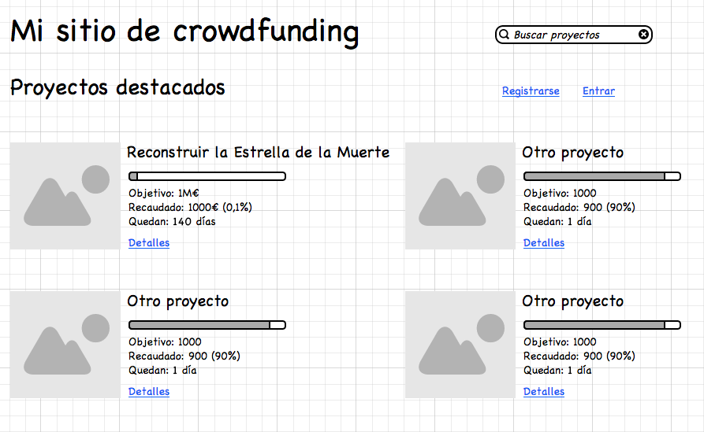
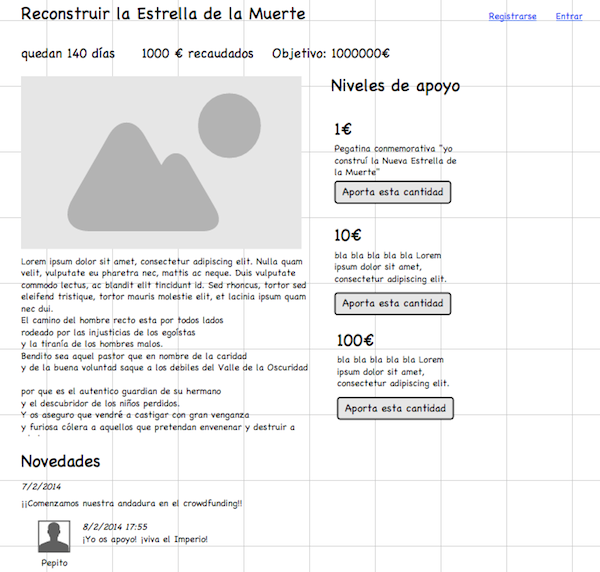

#Propuesta de práctica 

La temática de la aplicación web a desarrollar en prácticas es libre. Podéis elegir cualquier tema: una tienda, un sitio de cursos *on line*, una mini-red social,... Para validar que sea una propuesta razonable y hacer que ya empecéis a pensar con cierto detalle en la aplicación, debéis entregar una propuesta de práctica.

La aplicación constará de

- Un API que implementará los casos de uso
- Un sitio web, que será la interfaz mediante la que los usuarios interaccionan con el API
- Una versión móvil del sitio web (por el momento la ignoraremos en esta propuesta)

Podéis ver un ejemplo de propuesta adjunto a este documento.

##Apartados de los que debe constar la propuesta

 - **Título**: (1 frase)
 - **objetivo** de la aplicación (1-2 párrafos)
 - Listado de **casos de uso** que debería implementar el API (mínimo de 1-2 frases por cada uno). Especificar también las restricciones de seguridad (*puede acceder cualquiera, tiene que estar autentificado, debe ser administrador,...*)
 - Diagrama con el **modelo de datos** (mínimo de 3 entidades, al menos debe haber relaciones 1:N y M:N). No es necesario seguir un formato estrictamente estándar en el diagrama.

> En las prácticas **no estaréis obligados a implementar todos los casos de uso ni el modelo de datos completo**. Se trata simplemente de validar que el dominio "da juego" para hacer la práctica. En los sucesivos enunciados se especificarán los requerimientos mínimos

 - **Mockup** de la futura web. Como mínimo de la página principal y una página más. Es importante que las páginas se puedan montar fácilmente con las funcionalidades que proporciona el API. Uno de los objetivos de estos *mockups* es "validar" que los casos de uso del API "tienen sentido".

> Un *mockup* es un bosquejo o prototipo de "baja fidelidad". Tiene que reflejar qué elementos aparecen en la página, pero no detallar los tamaños exactos, tipos de letra, etc.
 
> El diagrama de datos y el *mockup* podéis dibujarlos a mano y hacer fotos, para simplificar la tarea. Si lo preferís podéis hacerlo con alguna herramienta gráfica.

##Entrega
 
 - La fecha límite de entrega es el **domingo 2 de octubre a las 23:55**
 - La entrega se realizará a través del **moodle** de la asignatura, en un documento PDF.

<!--BREAK-->

#Ejemplo de propuesta de práctica

##Título
Aplicación web de *crowdfunding*

##Resumen
Se desarrollará una aplicación para gestionar proyectos que requieran financiación mediante *crowdfunding*. Se podrán crear proyectos y especificar tipos de recompensas en función de la aportación de dinero. Por otro lado se podrán buscar proyectos, aportar dinero a los que nos interesen y estar al tanto de las novedades que envíen sus creadores sobre el mismo. (NOTA: las funcionalidades de pago *on-line* serán simuladas, no reales)

##API.Casos de uso 

+ Registro/modificación/Baja de usuarios (para modificación/baja hay que estar autentificado como el usuario en cuestión)
+ Listar proyectos "destacados" (marcados como tales por el personal de la empresa, o bien los más visitados)
+ Obtener todos los detalles de un proyecto dado su `id`.
+ Buscar proyectos por título y/o descripción
+ Creación/modificación/eliminación de proyectos (Para creación hay que estar autentificado. Para modif/elim. hay que ser el creador del proyecto)
+ Listado/creación/modificación/eliminación de "niveles de apoyo" (diferentes cantidades a aportar que a cambio nos dan diferentes recompensas). Para todos ellos hay que estar autentificado y ser el creador del proyecto.
+ Apoyar económicamente un proyecto (hay que estar autentificado)
+ Listar proyectos que se han apoyado (hay que estar autentificado y haber apoyado los proyectos)
+ Listar noticias sobre un proyecto que se ha apoyado (idem al anterior)
+ Comentar una noticia sobre un proyecto que se ha apoyado (idem al anterior)

##Modelo de datos

##Mockups del sitio web

> NOTA: los siguientes *mockups* se han realizado con la herramienta *online* [moqups](moqups.com). La versión gratuita permite crear 2 proyectos con un máximo de 5 páginas cada uno.

###Página principal

###Detalles del proyecto

