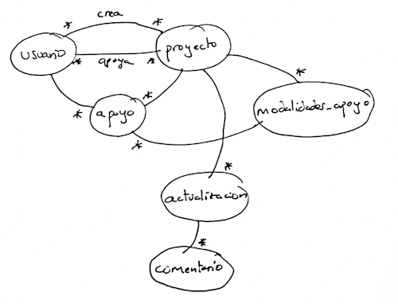

# Práctica evaluable 1: Diseño e implementación de APIs REST

El objetivo de esta práctica es aprender a diseñar correctamente APIs REST. Cada uno podéis elegir el dominio que queráis para la aplicación: una tienda, una red social, un sitio de *crowdfunding*,... 

> Importante: por el momento vamos a diseñar **solamente el API**, no el sitio web. Este se desarrollará en la práctica siguiente. Eso quiere decir que por el momento no tendremos interfaz de usuario.

## Paso previo: diseño general del API

### Identificación de los recursos

Debéis identificar los recursos que vais a modelar en el API, que se corresponderán con las entidades del dominio de vuestra aplicación. Por ejemplo en un API para un sitio de *crowdfunding* tendríamos "proyectos". "usuarios", "modalidades de apoyo" (una recompensa que se obtiene cuando un usuario apoya un proyecto con una determinada cantidad), etc. Identificad también los campos de cada recurso. Por ejemplo un proyecto tendrá un título, una descripción, una fecha límite, etc.

Además de identificar los recursos debéis identificar las relaciones entre ellos. Dibujad un grafo que muestre estas relaciones. No es necesario que uséis una notación estándar para las relaciones, ni tampoco que dibujéis con una herramienta gráfica, podéis simplemente dibujar a mano y hacer una foto.

En este ejemplo (cutre, pero no espero que hagáis nada más sofisticado) los arcos indican relaciones y los `*` indican `a muchos`.

### Formulación de los casos de uso simplificados

Con "simplificados" queremos decir que basta con formularlos de forma sencille en un par de líneas. En nuestro ejemplo del *crowdfunding* serían algo como:

* Un usuario sin estar autentificado debe poder ver los datos más importantes de la lista de proyectos más populares en el sitio
* Un usuario sin estar autentificado debe poder ver todos los datos de un proyecto
* Un usuario autentificado debe poder elegir una modalidad de apoyo y apoyar un proyecto con esa cantidad
* El usuario que ha creado un proyecto, si está autentificado debe poder enviar actualizaciones (==noticias) sobre el estado del mismo
* Un usuario debe poder hacer login en la aplicación
...

Cuestiones importantes sobre los casos de uso:

1. *Las llamadas del API deben estar orientadas a satisfacer los casos de uso, aunque no es necesario que haya una correspondencia 1:1*. Es posible que para resolver un caso de uso hagan falta varias llamadas al API. Por ejemplo es posible que para ver un proyecto incluyendo todas las novedades (*actualizaciones*, en el diagrama) hagan falta dos llamadas al API: una para los datos básicos del proyecto y otra para las actualizaciones. Dependerá si los datos básicos sin actualizaciones o las actualizaciones pueden tener uso por sí mismos para otro caso de uso.
2. *No es necesario que implementéis todos los casos de uso (como aparece en los requisitos mínimos)*, así que no os quedéis cortos en este apartado, cuanto más pongáis más os hacéis una idea del potencial y las posibilidades de vuestro API.

La documentación sobre los recursos identificados y los casos de uso **se debe incluir en la entrega** (1-2 páginas, no es necesario más). Además, una vez diseñado el API a partir de esto debéis hacer una correspondencia entre llamadas al API y caso de uso que satisfacen (1-2 páginas más máximo).

## Requisitos mínimos de la implementación

Como mínimo todas las prácticas deben cumplir estos requisitos para poder aprobar. La implementación debe realizarse usando Node y Express. 

### Implementación de las llamadas al API 

> Importante: aunque hayáis puesto como caso de uso hacer login en el sistema, por el momento lo vamos a ignorar

Se deben implementar al menos 7 llamadas distintas al API (más la de autentificación, o *login*, que se describe en el apartado siguiente). Debe haber al menos dos casos de GET (1 de lectura de un recurso sabiendo su `id` y 1 de lectura de una colección), y al menos un caso de POST, PUT y DELETE. Esto nos da 5 llamadas. Las dos restantes pueden ser del tipo que queráis.  

Se debe realizar *testing* de todas las llamadas al API. Se propone usar Mocha y supertest, pero en su lugar podéis usar las herramientas que deseéis.

### Autentificación

El API debe permitir autentificación mediante JSON web token. Para ayudaros en la implementación solo podéis usar el paquete [jwt-simple](https://www.npmjs.com/package/jwt-simple) pero no más librerías adicionales.

En el contexto de JSON Web token "hacer login en la aplicación" es realmente "obtener el token". Mapeadlo con una petición POST a la URL que queráis, pasando en la petición HTTP el login y el password en JSON y obteniendo como resultado en *token* en el cuerpo de la respuesta. Esta es una llamada adicional a las otras 7 que debéis implementar.

## Persistencia de datos

En principio los datos devueltos por el API y que se creen a través de él se almacenarán en memoria, como hacemos en el ejemplo de la lista de la compra. Podéis usar la estructura de datos que queráis. Si en lugar de guardar datos en memoria usáis una base de datos se os contará como requisito adicional.

Para inicializar los datos en memoria o en la BD podéis ayudaros de herramientas como [`faker.js`](https://github.com/marak/Faker.js/), se mostrará brevemente su uso en clase.

## Requisitos "adicionales"

Para poder puntuar estos requisitos es necesario haber implementado correctamente los requisitos mínimos. De este apartado podéis elegir los requerimientos que deseéis.

**(2 puntos)** Implementar la persistencia del API con base de datos. Podéis usar para ello la base de datos y las librerías de acceso que queráis. En caso de implementar este apartado no es necesario guardar además los datos en memoria.

**(1 ó 1.5 puntos)** Implementar el acceso real a un API externo para cumplir con alguna funcionalidad. Por ejemplo supongamos un sitio de búsqueda de hoteles en ciertas fechas que en la ficha de cada hotel incuye el tiempo que va a hacer ese día, obtenido de un API externo. **Si el API externo usa OAUth se podrán obtener hasta 1.5 puntos, si usa un mecanismo más sencillo, hasta 1**. En este apartado os podéis ayudar de cualquier librería JS/paquete npm.

**(1 punto)** Documentar el API usando alguna de las herramientas que se comentaron brevemente en clase de teoría, o cualquier otra que conozcáis.

**(1 punto)** Implementar *hipermedia* en el API. Cada caso de uso debería incluir enlaces a las operaciones más significativas relacionadas con el caso de uso actual.

**(1 punto)** Desplegar el API en algún servicio en la *nube* como por ejemplo en Heroku u otro similar.

**(1 punto)** Implementar *paginado* en el API

## Plazo de entrega

El plazo de entrega de la práctica concluye el **lunes día 23 de octubre a las 23:55**. La entrega se realizará en moodle enviando un único archivo comprimido en .zip o similar. 

Se entregará:

- Un proyecto Node con un `package.json` con las dependencias. No debéis incluir el directorio `node_modules` en la entrega, ya que si las dependencias están especificadas correctamente en el `package.json`, los paquetes se pueden instalar automáticamente con `npm install`.  

- Un archivo con la documentación de casos de uso, de relaciones entre llamadas al API y casos de uso y el diagrama de relaciones entre recursos. Puede ser tan simple como un txt y un png, o un pdf.

