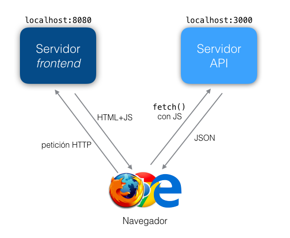

# Práctica evaluable 2: Aplicaciones web en el lado del cliente

El objetivo de esta práctica es desarrollar una web que sirva de cliente al API que se implementó en la práctica anterior. 

**Tendrás que hacer una pequeña modificación en el código de tu práctica anterior** para que pueda funcionar junto con la nueva web. Estos se describen en el [apéndice](#apendice).

## Requisitos mínimos

La implementación correcta de estos requisitos es necesaria para poder aprobar la práctica. Con estos requisitos se obtienen 6 puntos. Todos los casos de uso de los requisitos mínimos deben implementarse con React

### Login/logout

Aunque en un API REST "puro" no existe formalmente la idea de "hacer login/hacer *logout*", para el usuario de la web es útil que existan las operaciones de *login* y el *logout*. De lo contrario tendría que estar introduciendo continuamente *login* y *password*. Debes implementar las siguientes funcionalidades:

- Por defecto, la aplicación mostrará en su página inicial un **componente React** que mostrará un formulario para hacer *login*.  
- Una vez comprobado que *login* y *password* son correctos, y obtenido el *token* se guardará este último en el *local storage*
- Cada vez que se haga una petición al servidor para una operación restringida enviaréis el *token* en la cabecera `Authorization`
- La operación de *logout* simplemente borrará el *token* del *local storage*. 
- Si el *token* está en `localStorage` el componente React debería mostrar el login del usuario y un botón/enlace para hacer *logout*. En caso contrario debería mostrar el formulario de login.

### Listado/edición de datos

Implementa al menos un componente React que permita **listar datos**, es decir que llame a un caso de uso del API tipo GET y que devuelva una colección. El componente debe tener las siguientes funcionalidades:

-  En cada resultado aparecerá un botón o enlace "ver detalles" que al pulsarlo mostrará todos los detalles del item en cuestión.
-  En cada resultado aparecerá un botón o enlace "eliminar" para eliminar el item
- En cada resultado aparecerá un botón "editar" para poder editar el item. Es probable que puedas reutilizar el componente que se te pide en el siguiente apartado.

### Creación de items

Implementa al menos otro componente React que permita **crear un nuevo item**, es decir que sea un formulario que permita introducir los datos y lo cree en el servidor llamando a un caso de uso POST del API

## Requisitos adicionales

Además de los 6 puntos de los requisitos mínimos, elegir de entre los siguientes:

- *(1 punto)*: estilo visual de la web. Se pueden usar *frameworks* CSS como [bootstrap](http://getbootstrap.com/css/), [foundation](http://foundation.zurb.com) o cualquier otro.
- *(2 puntos)* Hace una implementación adicional de las funcionalidades de listado/edición y creación de items pero sin usar React ni ningún otro *framework*. Solo se puede usar Javascript estándar y alguna librería de plantillas como *handlebars*. Podéis partir de [este ejemplo](https://github.com/ottocol/vanillaJS-lista-compra) para ayudaros en la implementación. Al ser una implementación adicional tendréis que ponerla en un HTML aparte, llamado por ejemplo "index_std.html".
- *(2 puntos)*: Implementar la arquitectura "flux/redux" en la aplicación. Los principios de esta arquitectura se verán en las clases de teoría del 14 y 21 de noviembre.
- *(1 punto)*: *testing*. Se debe implementar *testing* de todos los componentes React usando alguno de los *frameworks* disponibles. Los más conocidos son [Jest](https://facebook.github.io/jest/) y [Enzyme](http://airbnb.io/enzyme/). O bien podéis usar los dos juntos como se explica en [este tutorial](https://www.codementor.io/react/tutorial/unit-testing-react-components-jest-or-enzyme)

## Entrega

El plazo de entrega concluye el domingo **11 de diciembre de 2017** a las 23:55 horas. La entrega se realizará como es habitual a través de Moodle. Entregad una carpeta comprimida con el proyecto de esta práctica y el de la anterior en dos subcarpetas, ya que ambos son necesarios para ejecutar la aplicación. 

Entregad también un LEEME.txt donde expliquéis brevemente las partes optativas que habéis hecho y cualquier detalle que consideréis necesario.

## <a name="apendice">Apéndice: Estructuración del código</a>

Una vez terminada esta práctica tendréis dos servidores en funcionamiento:

- El servidor del API, que corre en el puerto 3000
- El servidor del *frontend* que vais a implementar en esta práctica. Usaremos de momento el `webpack-dev-server`, que corre por el puerto 8080

Un usuario final que quiera acceder al *frontend* de la aplicación se conectaría al servidor web de esta práctica. El código JS que contiene el *frontend* hará peticiones REST al servidor del API.



Como las peticiones del *frontend* al API se hacen con Javascript en el entorno del navegador necesitamos que el servidor del API implemente el estándar CORS para que el navegador se "salte" la política de seguridad del "mismo origen". En caso contrario el JS solo podría hacer peticiones al servidor del *frontend* pero no al del API.

### Modificación del código de la práctica anterior

Para añadir soporte de CORS al servidor del API lo más sencillo es usar un paquete `npm` que lo implemente, por ejemplo el paquete `cors`

1. En el proyecto de la práctica anterior instalar el paquete `cors` con 

    ```bash
    npm install cors
    ```

2. En el código principal añadir:

    ```javascript
    var cors = require('cors')
    //Suponiendo "app" la variable obtenida como app=express()
    app.use(cors())
    ```

### Creación del proyecto de la práctica actual

Podéis partir de [esta plantilla](https://github.com/ottocol/plantilla_webpack/archive/master.zip).

Seguid las instrucciones del README de [https://github.com/ottocol/plantilla_webpack/](https://github.com/ottocol/plantilla_webpack/) para ejecutar el servidor del *frontend*.