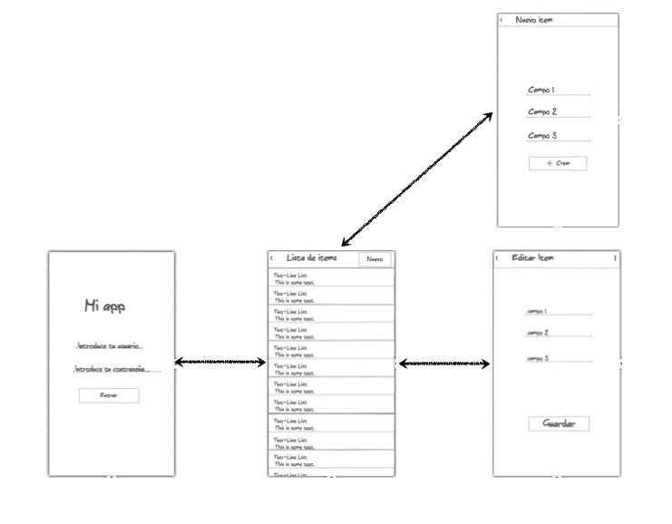

# Práctica evaluable 3: Aplicaciones web en dispositivos móviles

**IMPORTANTE**: esta práctica es optativa. En caso de entregarla, su puntuación se sumará al total obtenido en la nota media de prácticas. Las prácticas 1 y 2 cuentan por igual en esta media. Esta suma se contabilizará aunque el resultado supere el 10 (aunque como es lógico en actas no se puede poner más de un 10). 

El objetivo de esta práctica es desarrollar una web/aplicación para móviles con las mismas funcionalidades que hicisteis en la práctica anterior pero adaptada a dispositivos móviles.

## Funcionalidades a implementar (1 punto)

Debéis implementar las mismas funcionalidades que teníais en la práctica anterior pero con una interfaz adecuada a dispositivos móviles. Esto quiere decir que en general por cada funcionalidad necesitaréis una pantalla nueva. Por ejemplo la lista de items puede aparecer en una pantalla, pero cuando se pulse sobre uno para editarlo se debería "saltar a otra pantalla", es decir, el formulario de edición debería ocupar toda la pantalla.

Tenéis dos opciones a elegir para la implementación:

a) **(0,75 puntos)** Usar una web convencional. Es probable que la mayoría de componentes React que habéis usado en la práctica anterior os sirvan con modificaciones en el HTML del `render()`. Adicionalmente **(0,25 puntos)**, podéis usar algún *framework* web para que la aplicación tenga un aspecto más de app móvil. Por simplicidad se recomienda usar [Ratchet](http://goratchet.com/), aunque se pueden usar otros como [Framework7](https://framework7.io/) u [Onsen UI](https://onsen.io/).

b) **(1 punto)** Usar React Native. Tendréis que cambiar el `render()` de todos los componentes React para que en lugar de generar HTML se pinten como *widgets* de iOS/Android.

## Entrega

El plazo de entrega concluye el domingo **10 de enero de 2018** a las 23:55 horas. La entrega se realizará como es habitual a través de Moodle. Entregad una carpeta comprimida con el proyecto de esta práctica y el de la anterior en dos subcarpetas, ya que ambos son necesarios para ejecutar la aplicación. 

