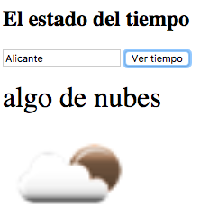

# Ejercicio de clase: *widget* del tiempo

Implementar una *miniapp* con HTML/JS en la que al introducir una localidad se consultará el estado del tiempo a un API externo y aparecerá este tanto en modo texto (p.ej. "cielo claro") como en forma gráfica, algo similar a lo siguiente:



Usaremos el API de OpenWeatherMap. Para consultar el tiempo de una localidad (y obtenerlo en español y con unidades del sistema métrico) hay que hacer una petición GET a la URL `http://api.openweathermap.org/data/2.5/weather?lang=es&units=metric&appid=<API_KEY>&q=<LOCALIDAD>` donde

- `<API_KEY>` es una clave que se obtiene al darse de alta como desarrolladores en OpenWeatherMap. Para no perder tiempo dándoos de alta podéis usar `1adb13e22f23c3de1ca37f3be90763a9` o bien `ff270fc66f9e533d3fb65fa7ee4b18d5`. (Los que tengáis DNI par usad la primera, los que lo tengáis impar la segunda. Si sois dos, tomad el DNI del mayor de ambos. Así repartiremos el uso de ambas claves, ya que el número de llamadas por minuto está limitado)
- `<LOCALIDAD>` es la localidad para la que queremos consultar el tiempo.

En el JSON que se obtiene como respuesta:

- Si se encuentra la localidad:
    - En el campo `weather[0].description` está el tiempo en modo texto, p.ej. "nubes" o "cielo claro".
    - En el campo `weather[0].icon` está el nombre del icono. La URL completa del icono es `http://openweathermap.org/img/w/` seguida del nombre del icono seguida de `.png`.
- Si la localidad no existe, en el JSON habrá un campo `cod` con valor 404

Podéis modificar la siguiente plantilla HTML como queráis, añadiendo JS, HTML, modificando el HTML existente...

```html
<html>
 <head>
     <meta charset="utf-8">
     <title>Widget del tiempo</title>
 </head>   
 <body>
 <h2>El estado del tiempo</h2>
 <input type="text"> <button>Consultar tiempo</button>
 <!-- en este div debería aparecer el tiempo en modo texto -->
 <div></div>
 <!-- aquí debe aparecer la imagen con el icono del tiempo -->
 
</body>
</html>
```