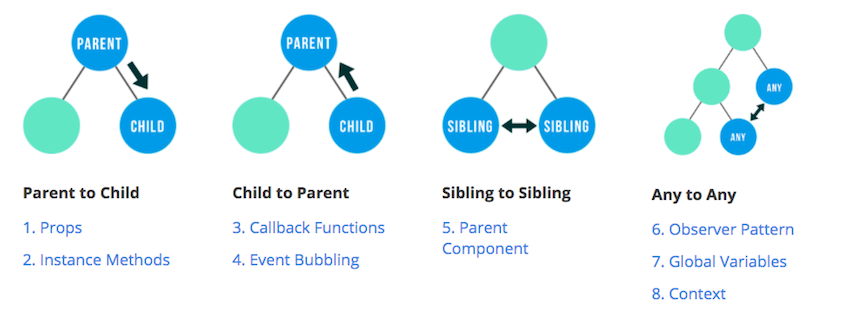
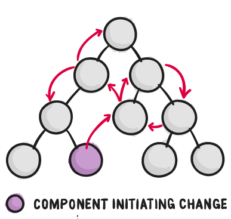
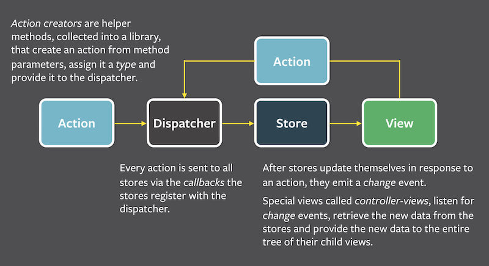
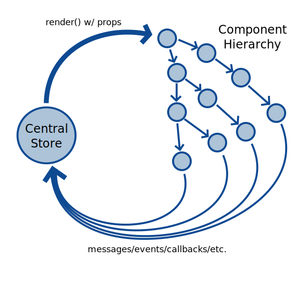
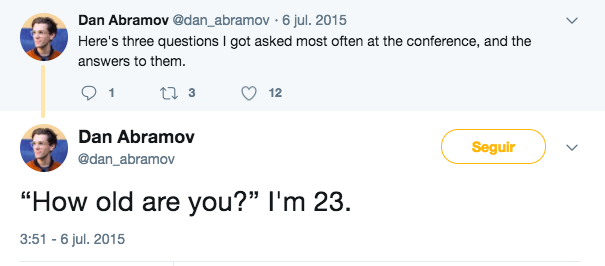
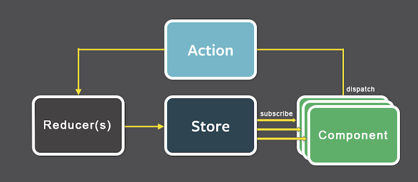

class: titulo, middle

# Tema 5
# Gestión del estado en el cliente web

---

¿A qué nos referimos con **estado** y por qué es complicado mantenerlo?


> "Como los requisitos en aplicaciones JavaScript de una sola página se están volviendo cada vez más complicados, nuestro código, mas que nunca, debe manejar el estado. **Este estado puede incluir respuestas del servidor y datos cacheados, así como datos creados localmente que todavía no fueron guardados en el servidor. El estado de las UI también se volvió más complejo**, al necesitar mantener la ruta activa, el tab seleccionado, si mostrar o no un spinner, si deben mostrarse los controles de paginación o no.

> **Controlar ese cambiante estado es difícil**. Si un modelo puede actualizar otro modelo, entonces una vista puede actualizar un modelo, el cual actualiza otro modelo, y esto causa que otra vista se actualice. **En cierto punto, ya no se entiende que esta pasando en la aplicación ya que perdiste control sobre el cuándo, el por qué y el cómo de su estado**. Cuando un sistema es opaco y no determinista, es difícil reproducir errores o agregar nuevas características".

.caption.right[Tomado de la documentación de Redux: "[Motivación](http://es.redux.js.org/docs/introduccion/motivacion.html)"]

---

class: titulo, middle

## 5.1
## Estado local vs estado centralizado

---

class: middle

Al estar la aplicación estructurada en **componentes** una idea natural es que **cada componente almacene localmente su estado**


---

## Comunicar componentes entre sí



.caption.center[[8 no-Flux strategies for React component communication](https://www.andrewhfarmer.com/component-communication/)]

---

class: middle 

Conforme crece el número de componentes **crece enormemente la complejidad del flujo de información** entre ellos




---

## Flux

Arquitectura propuesta por Facebook para **simplificar el flujo de comunicación** en la aplicación. El flujo está **centralizado** y es lo más **unidireccional** posible



---

Además del flujo unidireccional, el **estado está centralizado** y almacenado **fuera de los componentes**



---

class: titulo, middle

## 5.2
## Redux

---

class: middle

.center[**Redux = Flux + Ideas de Programación Funcional**]

- Inmutabilidad
- Funciones sin efectos laterales


---

Original del 2015, en un par de años redux se ha convertido en **la variante de Flux más popular**, sobrepasando incluso a la implementación soportada por Facebook




El desarrollador principal de redux es un tal Dan Abramov


---

Para **aplicaciones pequeñas, Redux no es necesario**

> **People often choose Redux before they need it**. “What if our app doesn’t scale without it?” **Later, developers frown at the indirection Redux introduced to their code**. “Why do I have to touch three files to get a simple feature working?” Why indeed!
People blame Redux, React, functional programming, immutability, and many other things for their woes, and I understand them. It is natural to compare Redux to an approach that doesn’t require “boilerplate” code to update the state, and to conclude that Redux is just complicated

.caption.right[Dan Abramov, [You Might Not Need Redux](https://medium.com/@dan_abramov/you-might-not-need-redux-be46360cf367)"]

---

class: middle, center

Redux es un *patrón* pero también un pequeño ***framework***. Es tan pequeño ([100 LOC](https://gist.github.com/gaearon/ffd88b0e4f00b22c3159) 😲) que en realidad podemos implementar muchas de sus funcionalidades nosotros mismos, sin `npm install redux`

---

## Los 3 principios de redux

- El estado está en una **única estructura de datos**
- El estado **es solo de lectura**
- Los cambios de estado se hacen con **funciones puras**, que devuelven un **nuevo estado**

---

## El estado es una única estructura de datos

La flexibilidad de JS nos permite representarlo todo en un **único objeto** con un conjunto de **propiedades**

```javascript
{
  login: 'pepe',
  lista: [
    {
      nombre: 'Pan',
      comprado: true,
    },
    {
      nombre: 'Patatas',
      comprado: false
    }
  ]
}
```

**ventajas**: el estado es más fácil de serializar, guardar, transmitir,...

---

## El estado es solo de lectura

El estado se puede leer pero no modificar directamente. La única forma es a través de  **acciones** (objetos que describen operaciones)

Una acción no es más que un objeto con un tipo (campo estándar `type` de tipo `String`) y un *payload* que depende de la acción

```javascript
export const ADD_ITEM = 'ADD_ITEM'
export const TOGGLE_ITEM = 'TOGGLE_ITEM'

{ type: ADD_ITEM,
  newItem: {nombre:'Tomates'} }

{ type: TOGGLE_ITEM,
  itemId: 1 }
```

- Las acciones se ejecutan de modo centralizado y en orden secuencial (no hay problemas de concurrencia)
- Al ser objetos, se pueden registrar en un *log*, serializar, almacenar y luego hacer un *replay* para depurar la app


---

## Cambios en el estado: *reducers*

*Reducer*: una función que dado un **estado** y una **acción** devuelve el **nuevo estado**

```javascript
f(estado, acción) => estado'
```

La función debe ser **pura**, es decir, *sin efectos laterales*
 - no referencia variables globales
 - no modifica los parámetros de entrada

---

Ejemplo de *reducers* para la app de la lista de la compra

```javascript
import {ADD_ITEM, TOGGLE_ITEM} from './acciones'

var itemId = 1

export default function listaReducer(estado = [], accion) {
   switch (accion.type) {
       case ADD_ITEM: return [
           ...estado,
           {  
               id: itemId++,
               nombre: accion.nombreItem,
               comprado: false
           }
       ]
       case TOGGLE_ITEM: return estado.map( (item) => {
           if (item.id === accion.itemId) {
               return Object.assign({}, item, {
                        comprado: !item.comprado
                      })
           }
           else return item
       })
       default: return estado
   }  
}
```
.caption[[https://github.com/ottocol/lista-compra-redux/blob/toggle-item/js/redux/reducers.js](https://github.com/ottocol/lista-compra-redux/blob/toggle-item/js/redux/reducers.js)]


---

## Inmutabilidad

El *reducer* no debe modificar el estado, sino devolver uno nuevo. Así:

- Es más fácil "viajar por la historia" del estado para depurar la *app*
- Se simplifica el chequeo de igualdad en algunos casos: si un objeto no puede mutar y en un momento dado vemos que `obj1 === obj2` (apuntan a la misma dirección de memoria) es que deben ser iguales.

---

## Combinar *reducers*

- Al ser simplemente funciones, un *reducer* puede llamar a otro (combinar *verticalmente*)
- También podemos hacer que cada *reducer* se encargue solo de algunos campos del estado (e ignore otros) (combinar *horizontalmente*)

```javascript
function rootReducer(estado=[], accion) {
    return {
        login: userReducer(estado, accion)
        lista: listaReducer(estado, accion)
    }
}
```

---

## Diagrama de flujo de Redux



---

## Redux en código

[https://github.com/ottocol/lista-compra-redux/blob/redux-sin-ui/js/main.js](https://github.com/ottocol/lista-compra-redux/blob/redux-sin-ui/js/main.js)
```javascript
import { createStore } from 'redux'
import { ADD_ITEM } from './redux/acciones';
import rootReducer from './redux/reducers'

//El store
var store = createStore(rootReducer)
//Nada más crear el store, redux llama al rootReducer con estado=undefined
//el rootReducer debería devolver el estado inicial
console.log(store.getState())

//En condiciones normales los componentes React son los que se suscriben
store.subscribe(function(){
    console.log(store.getState())
})

//Creamos y despachamos las acciones manualmente
//Normalmente lo harían los componentes
var a1 = { type: ADD_ITEM, nombreItem: 'pan' }
store.dispatch(a1)

var a2 = { type: ADD_ITEM, nombreItem: 'patatas' }
store.dispatch(a2)
```

---

## Action creators

Idea sencilla: función que devuelve una acción. Para no tener que andar "peleando" en el código con la constante del `type` y con formar el objeto


```javascript
function addItem(nombre) {
    return {type: ADD_ITEM, nombreItem: nombre}
}

//ahora el dispatch queda más "limpio"
store.dispatch(addItem('pan'))
```


---

class: titulo, middle

## 5.3.
## Redux y React


---

**Presentational Components**: no "saben" que la aplicación usa redux, simplemente obtienen sus datos a través de *props* (que otro tipo de componentes saca del *store* para pasarle a ellos) 

```javascript
class Lista extends React.Component {
    constructor(props) {
        super(props)
    }

    render() {
        var listaItems = this.props.items.map((item)=>{
            return <Item key={item.id}
                         itemId={item.id}
                         nombre={item.nombre}
                         comprado={item.comprado}
                         handleToggle={this.props.handleToggle} />
         ...
        })
     }
}                
```

---
**Container components:** se suscriben a actualizaciones del estado del *store* y/o le despachan acciones. Para forzar el repintado cuando cambia el estado de redux, se copia este en el estado del componente.

```javascript
class ListaContainer extends React.Component {
    constructor(props) {
        super(props)
        this.handleToggle = this.handleToggle.bind(this)
        this.state = {items:[]}
    }
    componentDidMount() {
        //Nos suscribimos a los cambios de estado del store
        this.props.store.subscribe(() => {
            this.setState({items:this.props.store.getState()})
        })
        this.props.store.dispatch(fetchItems())
    }
    handleToggle(itemId) {
        this.props.store.dispatch(toggleItem(itemId))
    }
    render() {
        return <Lista items={this.state.items} handleToggle={this.handleToggle}/>
    }
}
```

---

## Pasarle el *store* al *container*

Un *container component* necesita una referencia al *store* para poder llamar a `subscribe` o `dispatch`. Lo más sencillo es pasarlo en `props`

```javascript
var store = createStore(...)
...
ReactDOM.render(
    <ListaContainer store={store}/>,
    document.getElementById('componenteLista'),
```

Si hubiera *container components* abajo en la jerarquía sería tedioso ir pasando el *store* todo el rato "para abajo"

---

`react-redux` es una librería que permite conectar un *container component* con un *store* de manera más sencilla y con una sintaxis simplificada frente al método "manual" (que es el que hemos visto)

---

## Acciones asíncronas

Las acciones por defecto en redux son síncronas. Para operaciones asíncronas, como llamar a un API, redux usa la idea de *thunk* (función creada para encapsular una operación).

Con una librería adicional, `redux-thunk`, podemos crear acciones que sean funciones. Esta función puede hacer la llamada al API y despachar acciones síncronas

---

En general una acción asíncrona lleva aparejadas una o varias síncronas

```javascript
function fetchItems() {
    return function(dispatch) {
        //Acción síncrona que indica "comienzo de operación"
        dispatch(requestItems())
        fetch(API_BASE_URL + 'api/items')
           .then(function(resp) {
               return resp.json()
           }, function(error){   //Usamos un callbck de error porque un bug nos impide usar catch
                                 //https://github.com/facebook/react/issues/6895
               console.log("Error: " + error)
           })
           .then(function(json){
               //Acción síncrona que indica "fin de operación, aquí está el resultado"
               dispatch(receiveItems(json))
           })

    }
}
```

La acción asíncrona se despacha igual que las síncronas (antes hay que configurar `redux-thunk`)

```javascript
store.dispatch(fetchItems())
```
